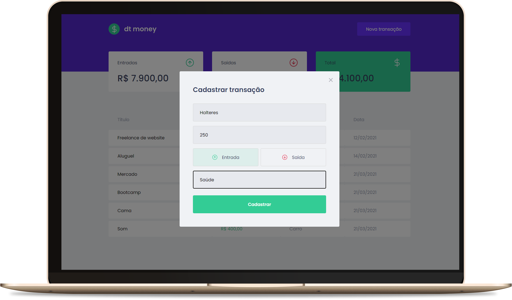

<h1 align="center">
  
</h1>

<h3 align="center">
  DTMoney, Frontend
</h3>

<blockquote align="center">“Mude você e todo o resto mudará naturalmente”!</blockquote>

  <a href="#-tecnologias">Tecnologias</a>&nbsp;&nbsp;&nbsp;|&nbsp;&nbsp;&nbsp;
  <a href="#-projeto">Projeto</a>&nbsp;&nbsp;&nbsp;|&nbsp;&nbsp;&nbsp;
  <a href="#-instalação-e-execução">Instalação e execução</a>&nbsp;&nbsp;&nbsp;|&nbsp;&nbsp;&nbsp;
  <a href="#-licença">Licença</a>

 

  

## 🚀 Tecnologias

Esse projeto foi desenvolvido com as seguintes tecnologias:

- [TypeScript](https://www.typescriptlang.org/)
- [React](https://reactjs.org)

## 💻 Projeto

O projeto tem como objetivo o estudo e desenvolvimento de uma aplicação em ReactJS com Typescript para controle financeiro.

Foi desenvolvida durante as aulas do Chapter II da trilha de ReactJS do Bootcamp Ignite da Rocketseat, e nela é possível cadastrar e excluir transações e ver o saldo de entrada e saída.

## 📥 Instalação e execução

Faça um clone desse repositório

### Frontend

1. A partir da raiz do projeto, entre na pasta rodando `cd frontend`;
2. Execulte `npm install` para instalar as dependências;
3. Execulte `npm run start` para iniciar o servidor de desenvolvimento;
4. Abra `http://localhost:3000` para ver o projeto no navegador.

## 👨‍💻 Desenvolvido

Armando Arlan Joergensen 

## 📝 Licença

Esse projeto está sob a licença MIT. Veja o arquivo [LICENSE](LICENSE.md) para mais detalhes.
